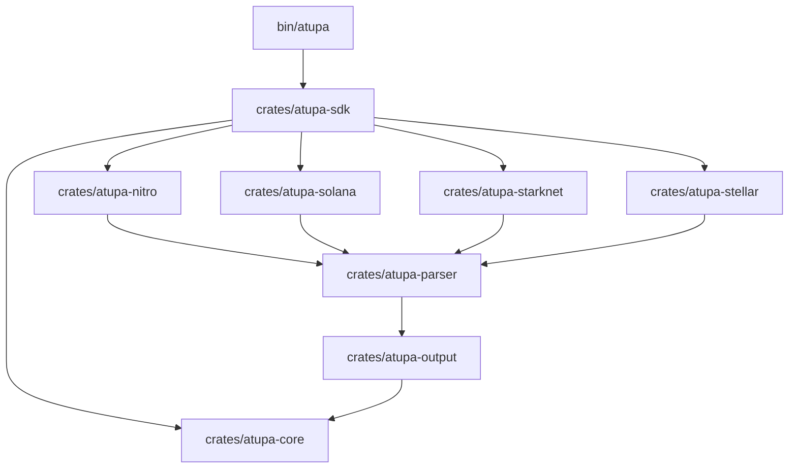

# 🏮 Atupa System Architecture

Atupa is a high-performance, modular infrastructure stack designed as a **Universal Multi-VM Execution Profiler**. This document details the technical design, data normalization strategies, and crate-level relationships that power the suite across diverse execution environments.

---

## 🏛 Core Philosophy: The Unified Trace Model

The central challenge Atupa solves is the fragmentation of execution data across different Virtual Machines (EVM, WASM, Cairo, SVM, Soroban). Each VM has its own "gas" units, log formats, and call-stack representations.

Atupa addresses this by normalizing all execution data into a **Unified Trace Step** (`TraceStep`):

```rust
pub struct TraceStep {
    pub pc: u64,           // Program counter or instruction index
    pub op: String,        // Opcode, HostFn name, or Program Label
    pub gas_cost: u64,     // Normalized execution weight
    pub depth: u16,        // Call-stack depth
    pub vm_kind: VmKind,   // The source VM (Evm, Stylus, Solana, etc.)
    pub stack: Option<Vec<String>>,
    // ... metadata
}
```

By mapping heterogeneous units (Solana Compute Units, Soroban HostFn weights, Cairo steps) into this model, Atupa enables **cross-chain execution diffing** and **unified flamegraph visualization**.

---

## 🏗 System Components

### 1. Network Adapters (The Sources)
Atupa connects to diverse execution environments via specialized clients:
- **`atupa-nitro`**: Handles Arbitrum's dual-VM state. It stitches standard Geth-style EVM traces with `stylusTracer` WASM logs.
- **`atupa-starknet`**: Interacts with the Starknet gateway to fetch `traceTransaction` data and flattens recursive Cairo call frames.
- **`atupa-solana`**: Implements a complex **Log Stitcher** state machine. Since Solana RPCs only provide sequential logs, Atupa reconstructs the nested call stack by tracking `Program...invoke` and `Program...success` markers.
- **`atupa-stellar`**: Parses Soroban `diagnostic_events` to reconstruct Host Function call trees.

### 2. The Aggregation Engine (`atupa-parser`)
Raw traces are often thousands of lines long. The parser performs:
- **Depth-Aware Folding**: Groups sequential opcodes into logical blocks while preserving call-stack integrity.
- **Instruction Normalization**: Maps VM-specific costs to a relative "unified cost" for cross-environment comparison.
- **Category Tagging**: Tags steps as `StorageRead`, `Memory`, `Crypto`, etc., to power the Studio's metric cards.

### 3. Visualization Engine (`atupa-output`)
Atupa generates high-fidelity visual artifacts without relying on external SaaS platforms:
- **SVG Flamegraphs**: Hand-crafted SVG templates with dynamic gradients that visually differentiate between VMs (e.g., Green for Solana, Purple for Starknet).
- **Interactive Diffing**: A specialized visual mode that overlays two traces, using color intensities to highlight gas regressions or optimizations.

### 4. Atupa Studio (`studio/`)
A local-first, high-performance web dashboard built with Vite + React + TypeScript. It features:
- **Zero-Dependency Flamegraphs**: Custom React components that render recursive trees directly into SVGs for maximum performance.
- **Trace Inspector**: A paginated, filterable view of the normalized execution timeline.

---

## 📦 Crate Hierarchy



---

## 🏮 Data Lifecycle

1. **Capture**: CLI fetches raw RPC data based on the transaction hash and endpoint signature.
2. **Normalize**: The chain-specific adapter converts raw logs/traces into `Vec<TraceStep>`.
3. **Stitch**: If the transaction crosses VM boundaries (e.g., Arbitrum), the Nitro adapter synchronizes the EVM and WASM clocks.
4. **Aggregate**: The parser collapses steps into a searchable tree.
5. **Render**: The Output engine generates either a terminal summary, a JSON report, or an interactive SVG.

---
🏮 *Atupa: Illuminating the path toward multi-VM transparency.*
