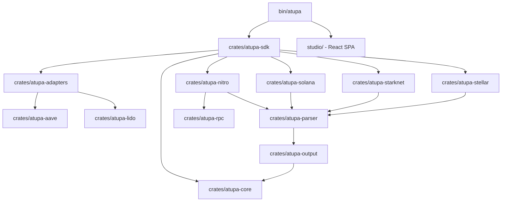

# 🏮 Atupa System Architecture

Atupa is a high-performance, modular infrastructure stack designed as a **Universal Multi-VM Execution Profiler**. This document details the technical design, data normalization strategies, and crate-level relationships that power the suite across diverse execution environments.

---

## 🏛 Core Philosophy: The Unified Trace Model

The central challenge Atupa solves is the fragmentation of execution data across different Virtual Machines (EVM, WASM, Cairo, SVM, Soroban). Each VM has its own native "gas" units, log structures, and call-stack representations.

Atupa addresses this by normalizing all execution data into a **Unified Trace Step** (`TraceStep`):

```rust
pub struct TraceStep {
    pub pc: u64,           // Program counter or instruction index
    pub op: String,        // Opcode, HostFn name, or Program Label
    pub gas: u64,          // Gas remaining
    pub gas_cost: u64,     // Normalized execution weight
    pub depth: u16,        // Call-stack depth
    pub vm_kind: VmKind,   // The source VM (Evm, Stylus, Solana, Starknet, Stellar)
    pub stack: Option<Vec<String>>,
    pub memory: Option<Vec<String>>,
    pub error: Option<String>,
    pub reverted: bool,
}
```

By mapping heterogeneous units (Solana Compute Units, Soroban HostFn weights, Starknet Cairo steps) into this model, Atupa enables **cross-chain execution diffing** and **unified flamegraph visualization**.

---

## 🏗 System Components

### 1. Multi-VM Adapters (`crates/atupa-*`)
Atupa connects to diverse execution environments via specialized clients:
- **`atupa-nitro`**: Handles Arbitrum's dual-VM state. Stitches Geth-style EVM traces with `stylusTracer` WASM HostIO logs (`msg_sender`, `storage_load_bytes32`, `native_keccak256`, etc.).
- **`atupa-starknet`**: Interacts with Starknet JSON-RPC (`starknet_traceTransaction`), flattening recursive Cairo function invocations and accounting for builtin weights (Pedersen, Range Check, Bitwise, Poseidon, ECDSA).
- **`atupa-solana`**: Implements a zero-allocation **Log Stitcher** state machine. Reconstructs nested instruction call trees from sequential `Program ... invoke` and `Program ... consumed/success` logs.
- **`atupa-stellar`**: Parses Soroban `diagnostic_events` to extract Host Function call trees and resource weights.
- **`atupa-aave`**: Semantic decoder for Aave v3 supply, borrow, flash loans, and GHO stablecoin liquidation audits.
- **`atupa-lido`**: Semantic decoder for Lido stETH staking, rebasing, and withdrawal queue lifecycle auditing.

### 2. Aggregation & Normalization (`atupa-parser`)
Raw traces frequently contain hundreds of thousands of steps. The parser performs:
- **Calldata & Memory Decoding**: Extracts 4-byte selectors and memory offsets (`decoder.rs`).
- **Depth-Aware Normalization**: Groups sequential opcode steps while maintaining call-stack depth boundaries (`normalize.rs`).
- **Collapsed Stack Building**: Converts normalized steps into aggregated flamegraph stacks resolved against registered protocol adapters (`aggregator.rs`).

### 3. Visual Rendering Engine (`atupa-output`)
Generates standalone, interactive SVG artifacts with zero runtime dependencies:
- **SVG Flamegraphs**: Hand-crafted SVG templates with dynamic color tokens differentiating between execution categories (Red for Storage Writes, Orange for Storage Reads, Teal for External Calls, Cyan for Solana, Purple for Starknet, Indigo for Soroban).
- **Differential Flamegraphs**: Dual-trace comparison SVG engine visualizing cost regressions in high-contrast red and optimizations in green.

### 4. High-Level Engine & CLI (`atupa-sdk` & `bin/atupa`)
- **`atupa-sdk`**: Programmatic entry point providing `execute_profile` with heuristic and explicit VM routing.
- **`bin/atupa`**: Modular CLI organized into dedicated command runners (`profile`, `capture`, `audit`, `diff`, `studio`, `init`).

### 5. Atupa Studio (`studio/`)
Local-first, high-performance web dashboard built with Vite + React 19 + TypeScript.
- Embedded directly into the `atupa` binary via `rust-embed` and served over a lightweight `axum` server.
- Supports drag-and-drop JSON report loading, hierarchical flamegraph zooming, category breakdowns, and paginated step-by-step trace inspection.

---

## 📦 Monorepo Crate Hierarchy



---

## 🏮 Data Lifecycle

1. **Capture**: CLI or SDK dispatches to the corresponding client based on the transaction format and RPC URL.
2. **Normalize**: The chain adapter converts raw logs or trace structs into `Vec<TraceStep>`.
3. **Stitch**: If the transaction crosses VM boundaries (e.g., Arbitrum), the Nitro stitcher synchronizes EVM and Stylus WASM windows.
4. **Aggregate**: The parser collapses steps into collapsed call-stacks resolved against the protocol `AdapterRegistry`.
5. **Render & Diff**: The output engine generates terminal summaries, JSON reports, SVG flamegraphs, or Markdown CI regression tables.

---
🏮 *Atupa: Illuminating execution across the modular blockchain landscape.*
